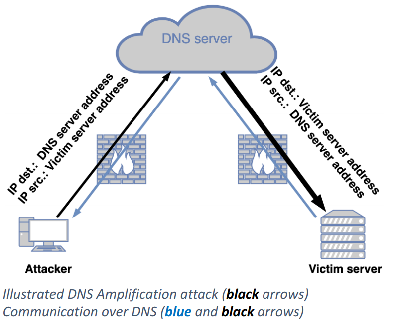

# ipv6-dns-shell
PoC of a ipv6 dns bind shell

  The shell is communicating with dns server, spoofing the source ip, so the packets are being 'reflected' to real receiver.
  This connection tehinque may bypass some firewalls, and provide uniqe way of getting shell :)

## More details 
Make sure to read how it works. You can find a article "DNS Reflection done right" on [PagedOut!](https://pagedout.institute/download/PagedOut_001_beta1.pdf) (page nr. 56)

 
# Author
@Srakai (swientymateusz at gmail d0t com)
